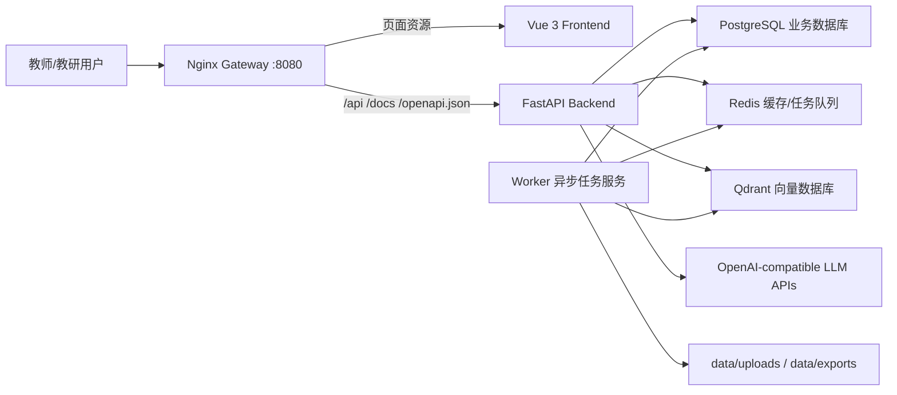
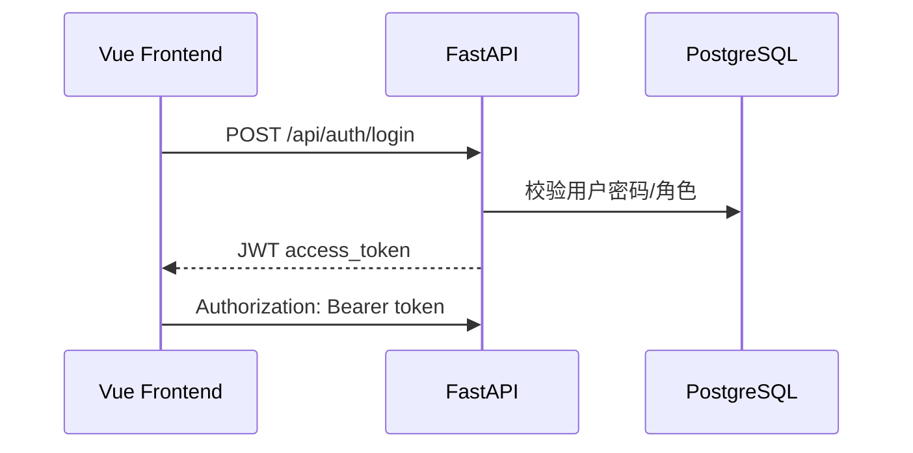
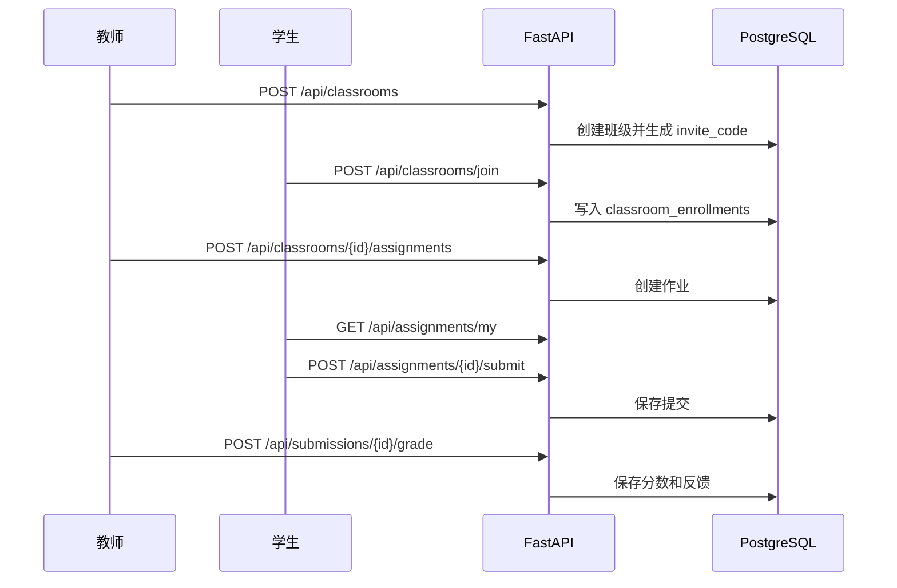
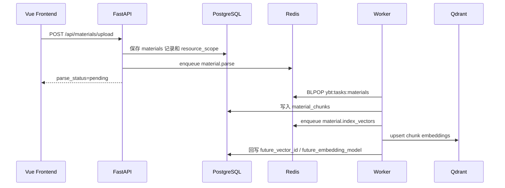
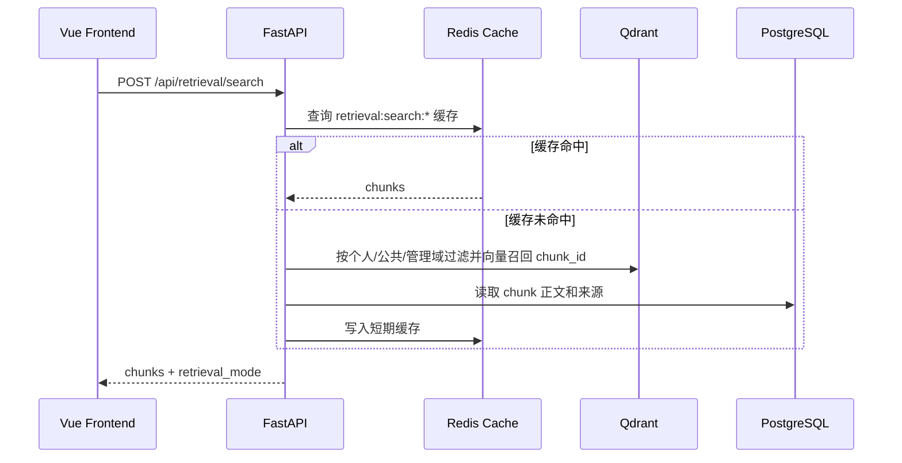
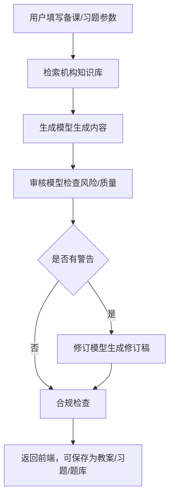

# 研备通 AI 当前架构与流程总览

## 1. 总体架构

当前系统采用“统一网关 + 前端 WebUI + 后端 API + 异步 Worker + 多数据库”的服务化结构。



核心分工：

- `gateway`：唯一外部入口，隐藏内部服务端口。
- `frontend`：教师工作台页面，只通过 `/api/*` 访问后端。
- `backend`：鉴权、接口编排、业务同步逻辑。
- `worker`：资料解析、向量索引、导出、后续 PPT 生成等异步任务。
- `postgres`：权威业务数据。
- `redis`：缓存、任务队列、任务状态。
- `qdrant`：资料分块 embedding 和语义检索。

## 2. 文件树职责

```text
YBT/
  docker-compose.yml
  infra/gateway/nginx.conf
  backend/
    Dockerfile
    requirements.txt
    .env.example
    app/
      main.py
      worker.py
      core/
      auth/
      ai/
      cache/
      tasks/
      classrooms/
      materials/
      retrieval/
      courses/
      lessons/
      exercises/
      questions/
      reviews/
      compliance/
      exports/
      logs/
    tests/
    scripts/seed_demo_data.py
  frontend/
    Dockerfile
    src/
      main.ts
      router.ts
      api/client.ts
      stores/auth.ts
      layouts/
      pages/
  data/
    uploads/
    exports/
  docs/
```

关键文件：

- `docker-compose.yml`：定义 gateway、frontend、backend、worker、postgres、redis、qdrant。
- `infra/gateway/nginx.conf`：网关转发规则。
- `backend/app/main.py`：FastAPI 应用入口，注册所有 router。
- `backend/app/worker.py`：异步任务进程入口。
- `backend/app/core/config.py`：环境变量、数据库、Redis、Qdrant、模型配置。
- `backend/app/core/database.py`：SQLAlchemy engine/session/建表逻辑。
- `backend/app/tasks/queue.py`：Redis 队列投递。
- `backend/app/tasks/handlers.py`：任务类型到处理函数的分发。
- `backend/app/classrooms/`：班级、邀请码、学生加入、作业发布/提交/批改。
- `backend/app/ai/service.py`：文本生成、多 AI 审核、修订。
- `backend/app/ai/embeddings.py`：embedding 生成封装。
- `backend/app/retrieval/vector_store.py`：Qdrant 向量库封装。
- `frontend/src/api/client.ts`：前端统一 API 请求。
- `frontend/src/router.ts`：前端页面路由。
- `frontend/src/layouts/WorkbenchLayout.vue`：工作台布局和侧边栏。

## 3. 数据层

当前不是单一数据库，而是多存储协同：

| 存储 | 职责 |
|---|---|
| PostgreSQL | 用户、角色、课程、资料元数据、材料分块正文、教案、习题、题库、审核、日志 |
| Redis | API 缓存、检索结果缓存、资料解析状态、异步任务队列 |
| Qdrant | 材料分块 embedding、语义检索索引 |
| 文件目录 | 上传原文件、导出的 DOCX/PPT/PDF 等 |

数据库表由各模块的 `models.py` 控制，例如：

- `auth/models.py`：用户、角色、权限。
- `classrooms/models.py`：班级、报名关系、作业、作业提交。
- `materials/models.py`：资料和资料分块。
- `courses/models.py`：课程、章节、课时、知识点。
- `lessons/models.py`：教案和版本。
- `exercises/models.py`：习题和版本。
- `questions/models.py`：题库。
- `logs/models.py`：操作日志、模型日志、任务日志。

## 4. API 接口流

### 4.1 登录鉴权



后续接口通过 `backend/app/core/deps.py` 做当前用户解析和权限校验。

角色边界：

- 管理员：负责系统运维、用户/RBAC、教师申请、日志和机构知识库全局维护；可只读查看所有课程、班级、作业、备课、习题和题库，但不能发布其他教师班级作业、批改作业或修改其他教师课程。
- 教管：负责教学域管理和教研审核，可管理教师课程、班级、作业审核流和教学数据。
- 教师：可创建课程和班级，管理自己班级的学生与作业，管理自己的备课、习题、个人资料。
- 学生：可通过邀请码加入班级，查看班级作业，提交作业并查看批改情况。
- 待审核教师：只保留账号状态，管理员通过后才获得教师权限。

### 4.2 班级、学生和作业



### 4.3 资料上传、解析、向量入库



核心代码：

- 上传接口：`backend/app/materials/router.py`
- 解析逻辑：`backend/app/materials/service.py`
- 文档解析器：`backend/app/materials/parsers.py`
- 向量入库：`backend/app/retrieval/vector_store.py`

### 4.4 知识库检索



当 Qdrant 未配置或不可用时，`retrieval/service.py` 自动回退关键词检索。

### 4.5 备课/习题生成与多 AI 协同



核心代码：

- 生成服务：`backend/app/ai/service.py`
- Prompt：`backend/app/ai/prompts.py`
- 备课：`backend/app/lessons/service.py`
- 习题：`backend/app/exercises/service.py`
- 合规：`backend/app/compliance/service.py`

## 5. 功能流程

主要业务流程：

1. 用户注册/登录，获得 JWT。
2. 上传教材、讲义、课件。
3. 按 `personal` 或 `public` 资源域保存资料，Worker 异步解析资料并建立向量索引。
4. 备课/习题生成时检索知识库作为参考上下文。
5. 生成模型产出内容，审核模型评审，必要时修订模型给出修订稿。
6. 合规模块检测敏感风险。
7. 用户保存教案、习题，习题可进入题库。
8. 教研管理员审核教案/题目。
9. 通过导出模块生成 DOCX。
10. 日志模块查看模型调用、后台任务、操作日志和系统健康。

## 6. 修改指南

新增后端业务模块：

1. 新建 `backend/app/<module>/models.py`、`schemas.py`、`service.py`、`router.py`。
2. 在 `backend/app/main.py` 导入 models 并 `include_router`。
3. 如需异步任务，在 `tasks/handlers.py` 注册任务类型。
4. 如需前端页面，在 `frontend/src/pages` 新增页面，在 `router.ts` 和 `WorkbenchLayout.vue` 接入。

修改数据库结构：

1. 改对应模块的 `models.py`。
2. 当前项目用 `create_all` 自动建表；已有 SQLite 兼容迁移在 `core/database.py`。
3. 如果后续长期维护，建议引入 Alembic 管理迁移。

修改向量检索：

1. embedding 逻辑改 `backend/app/ai/embeddings.py`。
2. Qdrant 集合、写入、检索逻辑改 `backend/app/retrieval/vector_store.py`。
3. 检索排序和回退逻辑改 `backend/app/retrieval/service.py`。

修改 AI 协同：

1. 管理员可在系统管理页维护生成、审核、修订、视觉模型的 Base URL、模型名和 API Key。
2. 数据库存储位置是 `ai_provider_configs`，接口位于 `/api/ai/admin/provider-configs`。
3. 运行时优先读取数据库配置，读不到再回退 `.env` 或 `core/config.py`。
4. 生成/审核/修订模型调用改 `ai/service.py`。
5. 具体 prompt 改 `ai/prompts.py`。

修改 Docker 服务：

1. 服务拓扑改 `docker-compose.yml`。
2. 外部路径转发改 `infra/gateway/nginx.conf`。
3. 后端镜像依赖改 `backend/requirements.txt` 和 `backend/Dockerfile`。
4. 前端依赖改 `frontend/package.json` 和 `frontend/Dockerfile`。

修改权限/班级：

1. 权限码和默认角色改 `backend/app/auth/permissions.py`。
2. 用户字段和账号状态改 `backend/app/auth/models.py`、`schemas.py`、`service.py`。
3. 管理端用户 API 改 `backend/app/auth/admin_router.py`。
4. 课程查看/管理边界改 `backend/app/courses/service.py`。
5. 班级、学生、作业、批改逻辑改 `backend/app/classrooms/`。
6. 资源域和机构知识库权限改 `backend/app/materials/` 与 `backend/app/retrieval/`。
7. 前端用户管理页面改 `frontend/src/pages/AdminPage.vue`。
8. 前端班级作业页面改 `frontend/src/pages/ClassroomsPage.vue`。

## 7. 教学树与内容归类

教学内容现在以课程树为主线组织：

```text
Course
  Chapter
    LessonSession
      KnowledgePoint
      Lesson
      Exercise
      Material
```

资料、教案、习题都可以保存 `course_id`、`chapter_id`、`session_id`、`knowledge_point_id`：

- 资料上传：`POST /api/materials/upload` 可带课程树 ID，资料仍受个人/公共资源域控制。
- 教案生成：`POST /api/lessons/generate` 可带课程树 ID、材料 ID、教师补充提示词、输出格式要求。
- 教案保存：`POST /api/lessons` 会保存课程树关联，并自动通过 `session_lesson_links` 挂到课次。
- 习题生成：`POST /api/exercises/generate` 可带课程树 ID、关联教案 ID、材料 ID、多 AI 核验参数。
- 习题保存：`POST /api/exercises` 会保存课程树关联；沉淀到题库时会自动带上课程/章节/课次/知识点。
- 课程资产：`GET /api/courses/{course_id}/assets` 返回资料、教案、习题的扁平资产列表，前端可按章节/课次/知识点分组展开。
- 前端入口：`MaterialsPage.vue` 上传资料时选择课程树归属；`LessonPage.vue` 和 `ExercisePage.vue` 生成/保存时选择课程树、材料和提示词；`CoursesPage.vue` 展示课程结构及已归类资产。

PPT 生成预留接口：

- `POST /api/presentations/lesson/{lesson_id}/generate`
- 当前会投递 `presentation.generate` 异步任务并记录 skipped 任务日志，后续只需替换 worker handler 即可接入真实 PPT 渲染。
